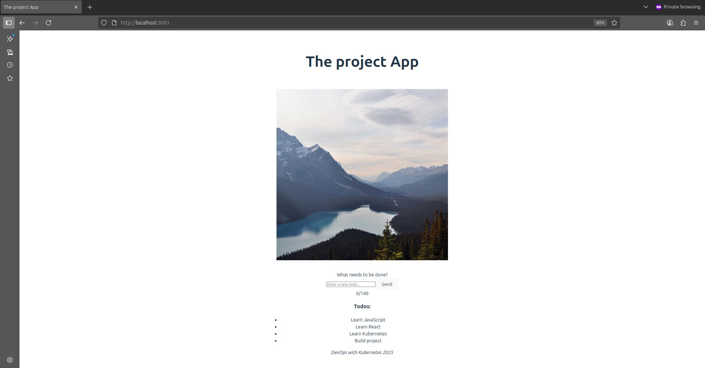
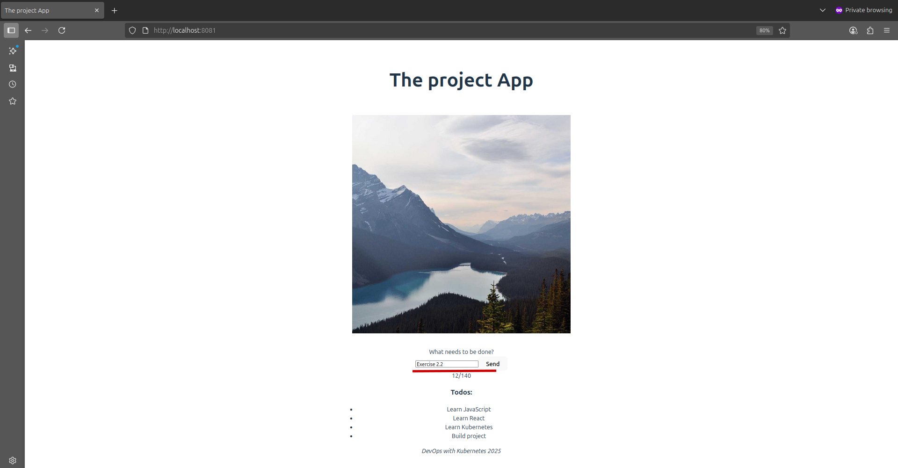

<!-- markdownlint-disable no-inline-html -->
# Kubernetes Exercise 2.2

New service, let us call it todo-backend, should have a GET /todos endpoint for fetching the list of todos and a POST /todos endpoint for creating a new todo. The todos are stored in memory (no database yet).

## Goal

* Add an input field for new todos
* Prevent input longer than 140 characters
* Add a "Send" button that **sends data to the backend**
* Display a list of todos fetched from `todo-backend`
* Keep the hourly image from the previous exercise
* Deploy todo-backend as a new service in Kubernetes

## Frontend Implementation

| Features | Description |
|----------|-------------|
| Image | Displays an image by calling `/api/image-service/random-image` |
| Input field | Text input for new todo with real-time validation |
| Character limit | Max 140 characters enforced via `maxLength` and UI feedback |
| Send button |  Disabled when input is empty or too long. On click, sends a `POST` request to `/api/todo-service/todos` |
| Todo list | Displays todos fetched from `todo-backend` via `GET /api/todo-service/todos` (no longer hardcoded) |

### Validation Rules

| RULE | HOW ENFORCED |
|------|--------------|
| Max 140 characters | `maxLength="140"` on `<\input>` |
| Send button disabled |  When `input.length === 0` or `input.length > 140` |
| Real-time counter | Display: `(120/140)` below input|
|Form submission | Prevents default, sends POST to API, clears input on success |

## The project structure

  ```tree
  the_project/
  ├── manifests/
  │   ├── storage/
  │   │   ├── persistentvolume.yaml
  │   │   └── persistentvolumeclaim.yaml
  │   ├── apps/
  │   │   ├── image-service/
  │   │   │   ├── deployment.yaml
  │   │   │   └── service.yaml
  │   │   └── todo-frontend/
  │   │   │   ├── deployment.yaml
  │   │   │   └── service.yaml
  │   │   └── todo-backend/
  │   │       ├── deployment.yaml
  │   │       └── service.yaml
  │   └── ingress.yaml
  ├── services/
  │   ├── image-service
  │   │   ├── Dockerfile
  │   │   ├── index.js
  │   │   ├── package.json
  │   │   └── README.md
  │   ├── todo-backend
  │   │   ├── Dockerfile
  │   │   ├── index.js
  │   │   ├── package.json
  │   │   └── README.md
  |   └── todo-frontend
  │       └── src/
  │           ├── App.jsx
  │           └── main.jsx
  └── README.md  
  ```
  
## Application Overview

### Frontend (React + Nginx)

* A static SPA built with React.
* Served via Nginx in a Docker container.
* Displays the cached image by calling `/api/image-service/random-image`.
* Uses SPA routing (fallback to index.html for all routes).
* Fetches and displays todos from todo-backend via /api/todo-service/todos.
* Sends new todos via POST `/api/todo-service/todos`.
* Uses SPA routing (fallback to index.html for all routes).

Image was pushed to Docker Hub repo: [yakovyakov/todo-frontend:
2.0](https://hub.docker.com/r/yakovyakov/todo-frontend/tags?name=2.0)

Application: [services/todo-frontend](./services/todo-frontend/)

### Image-Service (Node.js + Express)

Backend service that:

* Fetches a random image from <https://picsum.photos/1200> once every 10 minutes.
* Saves the image to a persistent volume at /usr/src/app/image-cache/* image.jpg.
* Serves the same image during the 10-minute window (with one grace request).
* Survives crashes by reading the cached image on restart.
* Configurable port via environment variable (PORT)
* Configurable cache path via environment variable (IMAGE_DIR)

Image was pushed to Docker Hub repo: [yakovyakov/image-service
1.0](https://hub.docker.com/r/yakovyakov/image-service/tags?name=1.0)

Application: [services/image-service](./services/image-service/)

### Todo-Backend (Node.js + Express)

New service responsible for managing todos:

* Stores todos in memory (array) — no database yet.
* Exposes:
  * `GET /todos` → returns list of todos
  * `POST /todos` → adds a new todo with `{ id, text, done }`
* Configurable port via environment variable (PORT)

Image was pushed to Docker Hub repo: [yakovyakov/todo-backend:1.0](https://hub.docker.com/r/yakovyakov/todo-backend/tags?name=1.0)

Application: [services/todo-backend](./services/todo-backend/)

## Kubernets Resources

| Resources | Purpose |
|-----------|---------|
|[PersistentVolume (PV)](./manifests/storage/persistentvolume.yaml) | Binds to a host path (/mnt/data/kube/image-cache) to store the image across restarts. |
| [PersistentVolumeClaim (PVC)](./manifests/storage/persistentvolumeclaim.yaml)| Allows the image-service pod to claim and mount the PV. |
| [Deployment (image-service)](./manifests/apps/image-service/deployment.yaml) | Runs the image-service container, mounts  the PVC, and sets environment variables. |
| [Service (image-service-svc)](./manifests/apps/image-service/service.yaml) | Exposes the image-service on port 2345 internally. |
| [Deployment (frontend)](./manifests/apps/todo-frontentd/deployment.yaml) | Runs the React app in an Nginx container. |
| [Service (frontend-svc)](./manifests/apps/todo-frontentd/service.yaml) | Exposes the frontend on port 2345. |
| [Deployment (todo-backend)](./manifests/apps/todo-backend/deployment.yaml) | Runs the todo-backend container and sets environment variables. |
| [Service (todo-backend-svc)](./manifests/apps/todo-backend/service.yaml) | Exposes the todo-backend on port 2345 internally. |
| [Ingress](./manifests/ingress.yaml) | Routes external traffic: <br> - `/api/image-service/*` →  `image-service-svc` <br> - `/`  → `frontend-svc` <br> - `/api/todo-backend/*` →  `todo-backend-svc`|

## Diagram

  ```mermaid
    graph TD
      subgraph Kubernetes Cluster
          subgraph Ingress
              I[Ingress Controller]
          end
         
          subgraph Image Service Deployment 
              IS[ Image Service Pod]
          end

          subgraph Frontend Deployment
              F[Frontend Pod]
          end

          subgraph Todo Backend Deployment
              TB[Todo-backened Pod]
          end

        
          subgraph Volumes
              PV[(Persistent Volume<br>Image Cache)]
          end
      end
    subgraph External Services
      EXT[External Image API<br>http:\/\/picsum.photos/1200]
    end
    

      User -->|GET /api/todo-service/todos| I
      User[Usuario] -->|GET /| I
      User -->|GET /api/image-service/random-image| I
      
    
      I -->|/todos| TB
      I -->|/</br>HTML, css, js| F
      I -->|/random-image| IS
    
      IS -->|Read/Write| PV
      IS -->|Return Image| EXT
  ```

## Initial setup

1. Create cluster (without Traefik):

    ```bash
    k3d cluster delete
    k3d cluster create --port 8082:30080@agent:0 -p 8081:80@loadbalancer --agents 2 --k3s-arg "--disable=traefik@server:0"
    ```

2. Install Nginx Ingress Controller:

    ```bash
    kubectl apply -f https://raw.githubusercontent.com/kubernetes ingress-nginx/main/deploy/static/provider/cloud/deploy.yaml
    ```
  
## Deployment

Apply all configurations:

  ```bash
  kubectl apply -f manifests/storage                   # PV & PVC
  kubectl apply -f manifests/apps/image-service        # Image service
  kubectl apply -f manifests/apps/todo-backend         # Todo backend
  kubectl apply -f manifests/apps/todo-frontend        # Frontend
  kubectl apply -f manifests/ingress.yaml              # Ingress
  ```

## Testing & Behavior

Normal Flow

* Visit <http://localhost:8081>
* See a random image (cached for 10 minutes)
* See list of todos
* Type a todo (≤140 chars) and click "Send"
* New todo appears in the list
* Refresh page → todo still visible (stored in backend memory)

### Test Endpoint Manually

  ```bash
  # Get todos
  curl http://localhost:8081/api/todo-service/todos

  # Create a new todo
  curl -X POST http://localhost:8081/api/todo-service/todos \
    -H "Content-Type: application/json" \
    -d '{"text": "Learn Kubernetes"}'
  ```

### Container Crash Test

  ```bash
  # Restart todo-backend
  kubectl delete pod -l app=todo-backend

  # Todos are lost (in-memory storage), but service recovers
  ### Manual Refresh (for testing)
  ```

  **Note:** Todos are stored in memory, so they are lost on restart

## Monitoring

Check logs:

```bash
kubectl logs -f deployment/image-service-dep
kubectl logs -f deployment/todo-frontend-dep
kubectl logs -f deployment/todo-backend-dep
```

Verify image cache:

  ```bash
  kubectl exec <image-service-pod> -- ls -l /usr/src/app/image-cache/
  # Should show: current_image.jpg
  ```

## ScreenShoot




