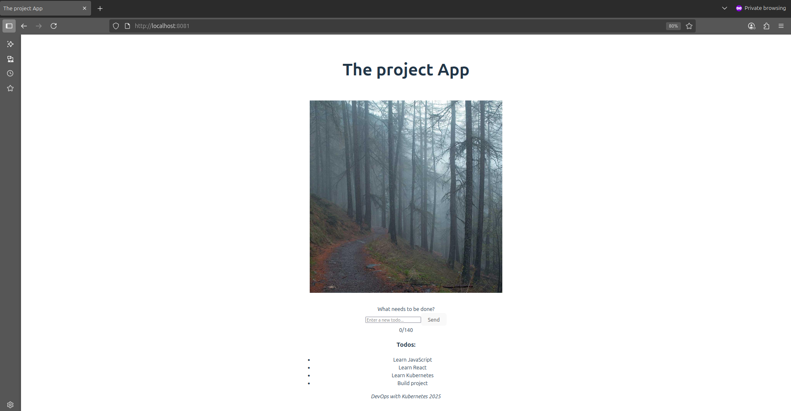

# Kubernetes Exercise 1.13

Todo App Functionality

Add basic todo input and display functionality to the frontend.

## Goal

* Add an input field for new todos
* Prevent input longer than 140 characters
* Add a "Send" button (no backend integration yet)
* Display a list of hardcoded todos
* Keep the hourly image from the previous exercise

## Frontend Implementation

| Features | Description |
|----------|-------------|
| Image | Displays an image by calling /api/image-service/random-image |
| Input field | Text input for new todo |
| Character limit | Max 140 characters enforced via `maxLength` and UI feedback |
| Send button |  Disabled when input is empty or too long |
| Todo list | Displays hardcoded todos (array in component state) |

### Validation Rules

| RULE | HOW ENFORCED |
|------|--------------|
| Max 140 characters | `maxLength="140"` on `<\input>` |
| Send button disabled |  When `input.length === 0` or `input.length > 140` |
| Real-time counter | Display: `(120/140)` below input|

## The project structure

  ```tree
  the_project/
  ├── manifests/
  │   ├── storage/
  │   │   ├── persistentvolume.yaml
  │   │   └── persistentvolumeclaim.yaml
  │   ├── apps/
  │   │   ├── image-service/
  │   │   │   ├── deployment.yaml
  │   │   │   └── service.yaml
  │   │   └── frontend/
  │   │       ├── deployment.yaml
  │   │       └── service.yaml
  │   └── ingress.yaml
  ├── services/
  │   ├── image-service/
  │   │   ├── src/
  │   │   │   └── server.js
  │   │   └── Dockerfile
  |   └── todo-frontend
  │       └── src/
  │           ├── App.jsx
  │           └── main.jsx
  └── README.md  
  ```
  
## Application Overview

### Frontend (React + Nginx)

* A static SPA built with React.
* Served via Nginx in a Docker container.
* Displays the cached image by calling /api/image-service/random-image.
* Uses SPA routing (fallback to index.html for all routes).

Image was pushed to Docker Hub repo: [yakovyakov/todo-frontend:
1.1](https://hub.docker.com/r/yakovyakov/todo-frontend/tags?name=1.1)

Application: [services/todo-frontend](./services/todo-frontend/)

### Image-Service (Node.js + Express)

Backend service that:

* Fetches a random image from <https://picsum.photos/1200> once every 10 minutes.
* Saves the image to a persistent volume at /usr/src/app/image-cache/* image.jpg.
* Serves the same image during the 10-minute window (with one grace request).
* Survives crashes by reading the cached image on restart.
* Configurable port via environment variable (PORT)
* Configurable cache path via environment variable (IMAGE_DIR)

Image was pushed to Docker Hub repo: [yakovyakov/image-service
1.0](https://hub.docker.com/r/yakovyakov/image-service/tags?name=1.0)

Application: [services/image-service](./services/image-service/)

## Kubernets Resources

| Resources | Purpose |
|-----------|---------|
|[PersistentVolume (PV)](./manifests/storage/persistentvolume.yaml) | Binds to a host path (/mnt/data/kube/image-cache) to store the image across restarts. |
| [PersistentVolumeClaim (PVC)](./manifests/storage/persistentvolumeclaim.yaml)| Allows the image-service pod to claim and mount the PV. |
| [Deployment (image-service)](./manifests/apps/image-service/deployment.yaml) | Runs the image-service container, mounts  the PVC, and sets environment variables. |
| [Service (image-service-svc)](./manifests/apps/image-service/service.yaml) | Exposes the image-service on port 2345 internally. |
| [Deployment (frontend)](./manifests/apps/todo-frontentd/deployment.yaml) | Runs the React app in an Nginx container. |
| [Service (frontend-svc)](./manifests/apps/todo-frontentd/service.yaml) | Exposes the frontend on port 2345. |
| [Ingress](./manifests/ingress.yaml) | Routes external traffic: <br> - /api/image-service/* →  image-service-svc <br> - /  → frontend-svc |

## Diagram

  ```mermaid
    graph TD
      subgraph Kubernetes Cluster
          subgraph Ingress
              I[Ingress Controller]
          end
         
          subgraph Frontend Deployment
              F[Frontend Pod]
          end
        
          subgraph Image Service Deployment 
              IS[ Image Service Pod]
          end
        
          subgraph Volumes
              PV[(Persistent Volume<br>Image Cache)]
          end
      end
    subgraph External Services
      EXT[External Image API<br>http:\/\/picsum.photos/1200]
    end

    
      User[Usuario] -->|GET /| I
      User -->|GET /api/image-service/random-image| I
      
    
      I -->|/</br>HTML, css, js| F
      I -->|/random-image| IS
      
    
      IS -->|Read/Write| PV
      IS -->|Return Image| EXT
  ```

## Initial setup

1. Create cluster (without Traefik):

    ```bash
    k3d cluster delete
    k3d cluster create --port 8082:30080@agent:0 -p 8081:80@loadbalancer --agents 2 --k3s-arg "--disable=traefik@server:0"
    ```

2. Install Nginx Ingress Controller:

    ```bash
    kubectl apply -f https://raw.githubusercontent.com/kubernetes ingress-nginx/main/deploy/static/provider/cloud/deploy.yaml
    ```
  
## Deployment

Apply all configurations:

  ```bash
  kubectl apply -f manifests/storage      # storage config
  kubectl apply -f manifests/apps/image-service   # image-service configs
  kubectl apply -f manifests/apps/todo-frontend   # frontend configs 
  kubectl apply -f manifests/ingress.yaml # ingress
  ```

## Testing & Behavior

Normal Flow

* Visit <http://localhost:8081>
* See a random image
* Refresh → same image for 10 minutes
* After 10 minutes + one grace request → new image
* Verify:
  * Image is displayed
  * Input field and "Send" button are visible
  * Hardcoded todos are listed
* Test input:
  * Type 141+ characters → input stops at 140
  * Button disables when empty
* Click "Send" → no crash (no action yet)

### Container Crash Test

  ```bash
  kubectl delete pod -l app=image-service
  ```

After restart pod App continues serving the same image thanks to the persistent volume.

### Manual Refresh (for testing)

Force a new image:

  ```bash
  kubectl exec <image-service-pod> -- rm /usr/src/app/image-cache/current_image.jpg
  ```

## Monitoring

Check logs:

```bash
kubectl logs -f deployment/image-service-dep
kubectl logs -f deployment/frontend-dep
```

Verify image cache:

  ```bash
  kubectl exec <image-service-pod> -- ls -l /usr/src/app/image-cache/
  # Should show: current_image.jpg
  ```

## ScreenShoot


