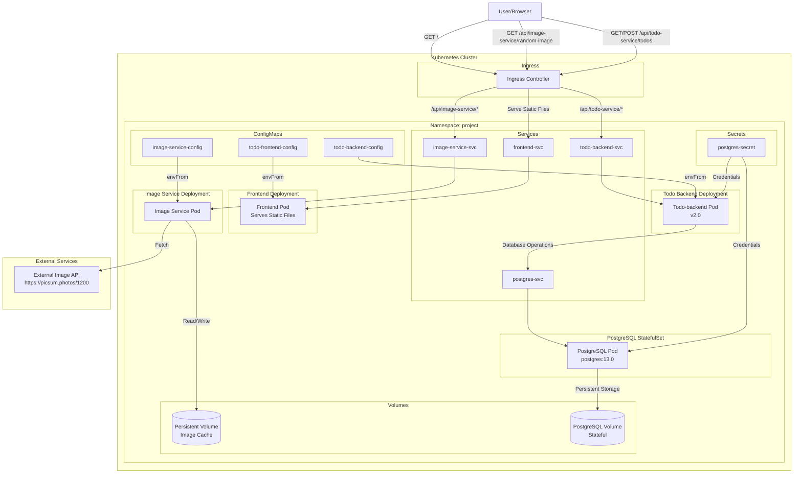
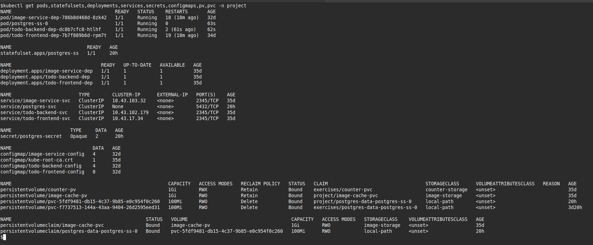
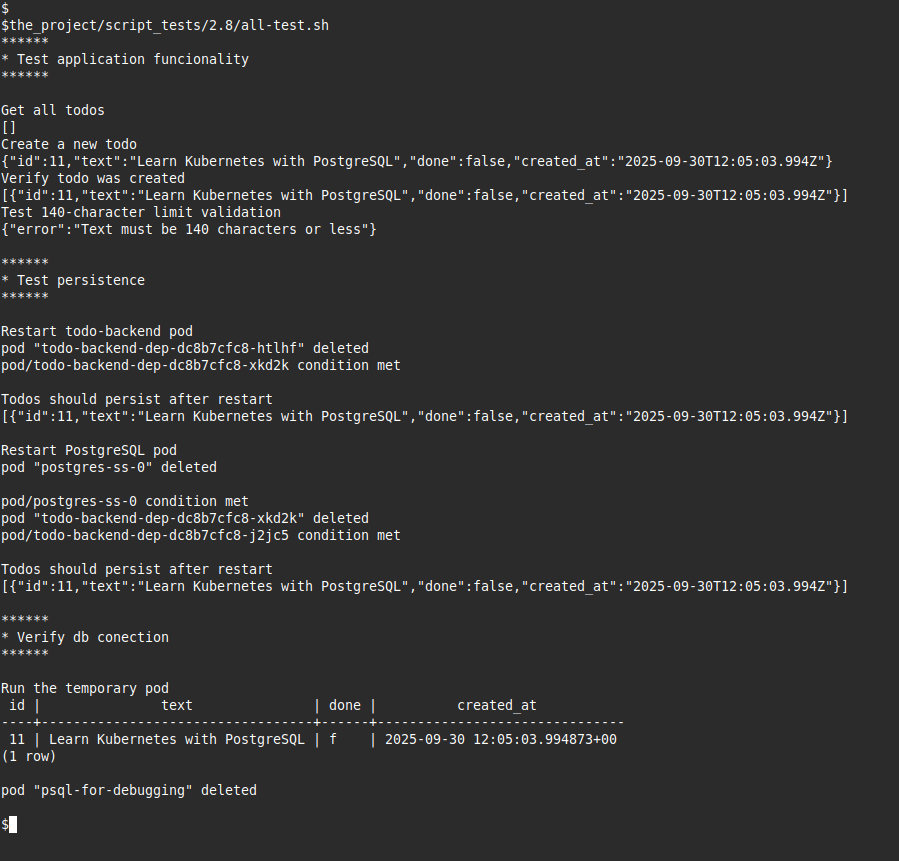
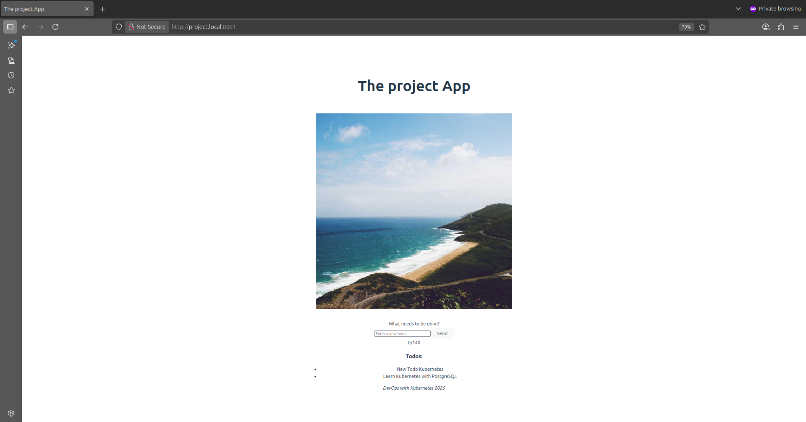

<!-- markdownlint-disable no-inline-html -->
# Kubernetes Exercise 2.8: Database Integration for Todo Application

This exercise integrates **PostgreSQL as a StatefulSet** to persist todo items in the project application, replacing the previous in-memory storage.

## Objective

* Use the existing PostgreSQL StatefulSet to store todo items

* Update the todo-backend service to use PostgreSQL database

* Use **Secrets and ConfigMaps** for secure database configuration

* Ensure todos persist across pod restarts and deployments

* Maintain the 140-character limit validation in the backend

## Components

| Component | Role |
|--------|------|
| `project` namespace | Isolated environment for the project |
| `postgres-ss` StatefulSet | PostgreSQL database for todo storage |
| `postgres-secret` | Secret containing database credentials |
| `postgres-svc` | Headless service for PostgreSQL |
| `todo-frontend` | React SPA served via Nginx |
| `todo-backend` (v2.0) | REST API: `GET /todos`, `POST /todos` (Updated to use PostgreSQL for todo persistence) |
| `image-service` | Fetches and caches a random image from `picsum.photos` |
| `image-cache-pvc` | PersistentVolumeClaim for storing the cached image |
| `project.local` | Custom domain for accessing the project |
| `todo-backend-config` | ConfigMap: `PORT`, `DB_HOST`, `DB_PORT`, `DB_NAME` |
| `image-service-config` | ConfigMap: `PORT`, `IMAGE_DIR`, `REFRESH_INTERVAL`, `API_IMAGE_URL` |
| `todo-frontend-config` | ConfigMap: reserved for future frontend configuration |

> Communication:
>
> * Frontend → `POST/GET /api/todo-service/todos` → todo-backend → PostgreSQL
> * Frontend → `GET /api/image-service/random-image`
> * `todo-backend` stores todos in PostgreSQL database

## The project structure

  ```tree
  the_project/
  ├── manifests/
  │   ├── configmaps/
  │   │   ├── todo-backend-config.yaml    # Updated with DB settings
  │   │   ├── image-service-config.yaml
  │   │   └── todo-frontend-config.yaml
  │   ├── storage/
  │   │   ├── persistentvolume.yaml
  │   │   └── persistentvolumeclaim.yaml
  │   ├── apps/
  │   │   ├── postgresql/                 # PostgreSQL StatefulSet
  │   │   │   ├── secret.yaml
  │   │   │   ├── statefulset.yaml
  │   │   │   └── service.yaml
  │   │   ├── image-service/
  │   │   │   ├── deployment.yaml
  │   │   │   └── service.yaml
  │   │   └── todo-frontend/
  │   │   │   ├── deployment.yaml
  │   │   │   └── service.yaml
  │   │   └── todo-backend/
  │   │       ├── deployment.yaml         # Updated with DB settings
  │   │       └── service.yaml
  │   └── ingress.yaml
  ├── services/
  │   ├── image-service
  │   │   ├── Dockerfile
  │   │   ├── index.js
  │   │   ├── package.json
  │   │   └── README.md
  │   ├── todo-backend
  │   │   ├── Dockerfile
  │   │   ├── index.js
  │   │   ├── package.json
  │   │   └── README.md
  |   └── todo-frontend
  │       └── src/
  │           ├── App.jsx
  │           └── main.jsx
  └── README.md  
  ```
  
## Application Overview

### Frontend (React + Nginx)

* A static SPA built with React.
* Served via Nginx in a Docker container.
* Displays the cached image by calling `/api/image-service/random-image`.
* Uses SPA routing (fallback to index.html for all routes).
* Fetches and displays todos from todo-backend via `/api/todo-service/todos`.
* Sends new todos via POST `/api/todo-service/todos`.
* Uses SPA routing (fallback to index.html for all routes).
* Uses **relative paths** → no hard-coded backend URLs.
* Future-ready: todo-frontend-config ConfigMap created for potential  environment-specific settings.

Image was pushed to Docker Hub repo: [yakovyakov/todo-frontend:
2.0](https://hub.docker.com/r/yakovyakov/todo-frontend/tags?name=2.0)

Application: [services/todo-frontend](./services/todo-frontend/)

### Image-Service (Node.js + Express)

Backend service that:

* Fetches a random image from <https://picsum.photos/1200> once every 10 minutes.
* Saves the image to a persistent volume at /usr/src/app/image-cache/* image.jpg.
* Serves the same image during the 10-minute window (with one grace request).
* Survives crashes by reading the cached image on restart.
* All configuration via environment variables:
  * `PORT`
  * `IMAGE_DIR`
  * `CACHE_TIME`
  * `API_IMAGE_URL`

Image was pushed to Docker Hub repo: [yakovyakov/image-service 2.0](https://hub.docker.com/r/yakovyakov/image-service/tags?name=2.0)

Application: [services/image-service](./services/image-service/)

### Todo-Backend (Node.js + Express + PostgreSQL) v2.0 - Updated

A Node.js REST API that now uses PostgreSQL for persistent todo storage:

* Stores todos in PostgreSQL instead of in-memory array

* Database schema:

    ```sql
    CREATE TABLE IF NOT EXISTS todos (
        id SERIAL PRIMARY KEY,
        text VARCHAR(140) NOT NULL,
        done BOOLEAN NOT NULL DEFAULT FALSE,
        created_at TIMESTAMP WITH TIME ZONE DEFAULT CURRENT_TIMESTAMP
    );
    ```

* Maintains 140-character limit validation in the backend

* Exposes:
  * `GET /todos` → returns list of todos
  * `POST /todos` → adds a new todo with `{ id, text, done }`
* Configuration:
  * From ConfigMap: `PORT`, `DB_HOST`, `DB_PORT`, `DB_NAME`
  * From Secret: `DB_USER`, `DB_PASSWORD`

Image was pushed to Docker Hub repo: [yakovyakov/todo-backend:2.0](https://hub.docker.com/r/yakovyakov/todo-backend/tags?name=2.0)

Application: [services/todo-backend](./services/todo-backend/)

### PostgreSQL Database (StatefulSet)

* PostgreSQL running as StatefulSet (postgres-ss)

* **Persistent storage** using `volumeClaimTemplates` with `local-path` storage class

* **Headless service** `postgres-svc` for direct pod discovery

* **Automated initialization** with database `todo-db`

* **Secure credentials** via Kubernetes Secret

## Kubernets Resources

### PostgreSQL Resources

| Resources | Purpose |
|-----------|---------|
| [StatefulSet (postgresql)](./manifests/apps/postgresql/statefulset.yaml) | PostgreSQL with PVC template |
| [Secret (postgresql)](./manifests/apps/postgresql/secret.yaml) | DB credentials (`DB_USER`, `DB_PASSWORD`) |
| [Service (postgresql)](./manifests/apps/postgresql/service.yaml) | Headless service for PostgreSQL |

### Application Resources

| Resources | Purpose |
|-----------|---------|
| [Deployment (image-service)](./manifests/apps/image-service/deployment.yaml) | Runs the image-service container, mounts  the PVC, and Uses `envFrom` to inject ConfigMap. |
| [Service (image-service-svc)](./manifests/apps/image-service/service.yaml) | Exposes the image-service on port 2345 internally. |
| [Deployment (frontend)](./manifests/apps/todo-frontentd/deployment.yaml) | Runs the React app in an Nginx container. |
| [Service (frontend-svc)](./manifests/apps/todo-frontentd/service.yaml) | Exposes the frontend on port 2345. |
| [Deployment (todo-backend)](./manifests/apps/todo-backend/deployment.yaml) | Runs the todo-backend container and Uses `envFrom` to inject ConfigMap and PostgreSQL Secret. |
| [Service (todo-backend-svc)](./manifests/apps/todo-backend/service.yaml) | Exposes the todo-backend on port 2345 internally. |

### Configuration Resources

| Resources | Purpose |
|-----------|---------|
| [ConfigMap (todo-backend-config)](./manifests/configmaps/todo-backend-config.yaml) | DB connection settings (`DB_HOST`, `DB_PORT`, `DB_NAME`) |
| [ConfigMap (image-service-config)](./manifests/configmaps/image-service-config.yaml) | `PORT`, `IMAGE_DIR`, `CACHE_TIME`, `API_IMAGE_URL` |
| [ConfigMap (todo-frontend-config)](./manifests/configmaps/todo-frontend-config.yaml) | Reserved for future frontend configuration (e.g. feature flags, API base paths if needed) |

### Storage & Networking

| Resources | Purpose |
|-----------|---------|
|[PersistentVolume (PV)](./manifests/storage/persistentvolume.yaml) | Binds to a host path (/mnt/data/kube/image-cache) to store the image across restarts. |
| [PersistentVolumeClaim (PVC)](./manifests/storage/persistentvolumeclaim.yaml)| Allows the image-service pod to claim and mount the PV. |
| [Ingress](./manifests/ingress.yaml) | Routes external traffic: <br> - `/api/image-service/*` →  `image-service-svc` <br> - `/`  → `frontend-svc` <br> - `/api/todo-backend/*` →  `todo-backend-svc`|

## Diagram



## Deployment Steps

### 1. Create cluster (without Traefik)

  ```bash
  k3d cluster delete
  k3d cluster create --port 8082:30080@agent:0 -p 8081:80@loadbalancer --agents 2 --k3s-arg "--disable=traefik@server:0"
  ```

### 2. Install Nginx Ingress Controller

```bash
kubectl apply -f https://raw.githubusercontent.com/kubernetes ingress-nginx/main/deploy/static/provider/cloud/deploy.yaml
```

### 3. Apply Kubernetes Resources

```bash
# Apply PostgreSQL resources (if not already deployed)
kubectl apply -f manifests/apps/postgresql/ -n project

# Wait for PostgreSQL to be ready
kubectl wait --for=condition=ready pod -l app=postgres -n project --timeout=120s

# Apply updated ConfigMap and Deployment
kubectl apply -f manifests/configmaps/todo-backend-config.yaml -n project
kubectl apply -f manifests/apps/todo-backend/deployment.yaml -n project

# Apply other resources (if not already deployed)
kubectl apply -f manifests/storage/ -n project
kubectl apply -f manifests/configmaps/ -n project
kubectl apply -f manifests/apps/todo-frontend/ -n project
kubectl apply -f manifests/apps/image-service/ -n project
kubectl apply -f manifests/ingress.yaml -n project

# Verify deployment
kubectl get pods -n project
```

> ⚠️ Note:<br>
> Although the YAML has namespace: project, it is still good practice to use -n project for consistency.<br>
> The `PersistentVolume` (PV) is cluster-scoped and does not use namespaces.  
> The `-n project` flag is ignored for `persistentvolume.yaml`, but it is required for `persistentvolumeclaim.yaml`.  
> This command works because Kubernetes safely ignores the namespace for cluster-scoped resources.

### 4. Configure local DNS

Add this line to `/etc/hosts` :

```text
127.0.0.1 project.local
```

## Access the Application

After setting up DNS:

* Frontend: `http://project.local`
* API Todos: `http://project.local/api/todo-service/todos`
* API Image: `http://project.local/api/image-service/random-image`

---

## Testing & Behavior

### Normal Flow

1. Open `http://project.local` in your browser
2. See a random image (cached for 10 minutes)
3. See list of todos
4. Type a new todo (≤140 chars), click "Send"
5. New todo appears in the list
6. Refresh → todos still visible

### Check All Resources

```bash
kubectl get pods,statefulsets,deployments,services,secrets,configmaps,pv,pvc -n project
```

### Verify Database Connectivity

  ```bash
  # Get the environment variables from the todo-backend pod
  DB_HOST=$(kubectl exec deployment/todo-backend-dep -n project -- sh -c 'echo $DB_HOST')
  DB_PORT=$(kubectl exec deployment/todo-backend-dep -n project -- sh -c 'echo $DB_PORT')
  DB_USER=$(kubectl exec deployment/todo-backend-dep -n project -- sh -c 'echo $DB_USER')
  DB_PASSWORD=$(kubectl exec deployment/todo-backend-dep -n project -- sh -c 'echo $DB_PASSWORD')
  DB_NAME=$(kubectl exec deployment/todo-backend-dep -n project -- sh -c 'echo $DB_NAME')

 # Run the temporary pod
  kubectl run -it --rm --restart=Never --image postgres psql-for-debugging -n project --   sh -c "PGPASSWORD='$DB_PASSWORD' PAGER=cat psql -q -h '$DB_HOST' -p '$DB_PORT' -U '$DB_USER' -d '$DB_NAME' -c 'SELECT * FROM todos;' -v ON_ERROR_STOP=1"

  ```

### Test Application Functionality

```bash
# Get all todos (should be empty initially)
curl http://project.local:8081/api/todo-service/todos

# Create a new todo
curl -X POST http://project.local:8081/api/todo-service/todos \
  -H "Content-Type: application/json" \
  -d '{"text": "Learn Kubernetes with PostgreSQL"}'

# Verify todo was created
curl http://project.local:8081/api/todo-service/todos

# Test 140-character limit validation
curl -X POST http://project.local:8081/api/todo-service/todos \
  -H "Content-Type: application/json" \
  -d '{"text": "This is a very long todo text that exceeds the 140 character limit that we have set for our todo application to ensure that todos remain concise and manageable for users"}'
```

### Test Frontend Integration

```bash
# Open the application in browser
open http://project.local:8081

# Create todos through the frontend form
# Verify they persist after page refresh
```

### Test Persistence

```bash

# Restart todo-backend pod
echo "Restart todo-backend pod"
kubectl delete pod -l app=todo-backend -n project
kubectl wait --for=condition=ready pod -l app=todo-backend -n project --timeout=120s
sleep 5

# Todos should persist after restart
echo "Todos should persist after restart"
curl http://project.local:8081/api/todo-service/todos

# Restart PostgreSQL pod
echo "Restart PostgreSQL pod"

kubectl delete pod -l app=postgres -n project

# Wait for restart and verify data persistence
kubectl wait --for=condition=ready pod -l app=postgres -n project --timeout=120s

kubectl delete pod -l app=todo-backend -n project
kubectl wait --for=condition=ready pod -l app=todo-backend -n project --timeout=120s
sleep 5

# Todos should persist after restart
echo "Todos should persist after restart"

curl http://project.local:8081/api/todo-service/todos
echo ""
```

## Troubleshooting

### Common Issues

1. **Database connection refused:** Check if PostgreSQL StatefulSet is running

2. **Table initialization failed:** Check todo-backend logs for SQL errors

3. **Authentication failed:** Verify secret values match between backend and PostgreSQL

4. **Data not persisting:** Check PVC binding and PostgreSQL logs

### Debug Commands

```bash

# Check todo-backend logs
kubectl logs deployment/todo-backend-dep -n project

# Check PostgreSQL logs
kubectl logs statefulset/postgres-ss -n project

# Verify database content
kubectl exec -it statefulset/postgres-ss -n project -- \
  psql -U postgres -d todo-db -c "SELECT * FROM todos;"

# Check environment variables
kubectl exec -it deployment/todo-backend-dep -n project -- env | grep DB_
```

### Database Verification

#### Check Database Schema

```sql

-- Connect to PostgreSQL and verify schema
\c todo-db
\d todos

-- Check table data
SELECT * FROM todos;

-- Verify character limit constraint
SELECT character_maximum_length 
FROM information_schema.columns 
WHERE table_name = 'todos' AND column_name = 'text';
```

## ScreenShoot

### Resources



### Tests



### Application in browser


