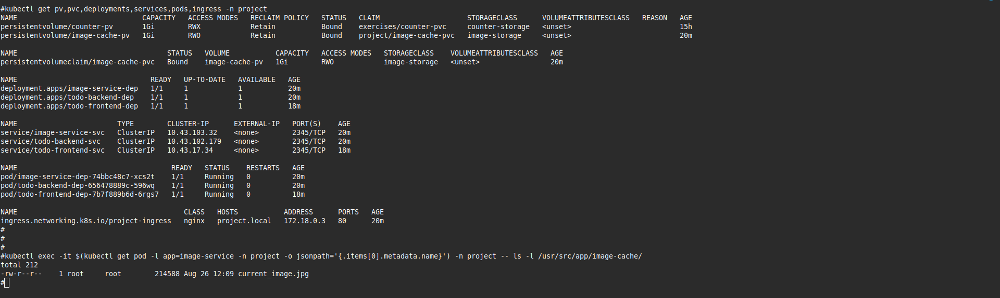

<!-- markdownlint-disable no-inline-html -->
# Kubernetes Exercise 2.4: The project, step 9

This exercise focuses on **namespace isolation for the project**. The goal is to create a dedicated namespace called `project` and move all project-related applications (`todo-frontend`, `todo-backend`, `image-service`) into it, separating the project from other exercises.

## Goal

* Create a namespace named `project`
* Move all project-related resources into the `project` namespace
* Configure Ingress to use `project.local` as the host
* Verify that the application continues to work correctly
* Use namespaces to isolate the project environment

## Components

| Component | Role |
|--------|------|
| `project` namespace | Isolated environment for the project |
| `todo-frontend` | React SPA served via Nginx |
| `todo-backend` | REST API: `GET /todos`, `POST /todos` (in-memory storage) |
| `image-service` | Fetches and caches a random image from `picsum.photos` |
| `image-cache-pvc` | PersistentVolumeClaim for storing the cached image |
| `project.local` | Custom domain for accessing the project |

> Communication:
>
> * Frontend → `GET /api/todo-service/todos`
> * Frontend → `GET /api/image-service/random-image`
> * `todo-backend` stores todos in memory

## The project structure

  ```tree
  the_project/
  ├── manifests/
  │   ├── storage/
  │   │   ├── persistentvolume.yaml
  │   │   └── persistentvolumeclaim.yaml
  │   ├── apps/
  │   │   ├── image-service/
  │   │   │   ├── deployment.yaml
  │   │   │   └── service.yaml
  │   │   └── todo-frontend/
  │   │   │   ├── deployment.yaml
  │   │   │   └── service.yaml
  │   │   └── todo-backend/
  │   │       ├── deployment.yaml
  │   │       └── service.yaml
  │   └── ingress.yaml
  ├── services/
  │   ├── image-service
  │   │   ├── Dockerfile
  │   │   ├── index.js
  │   │   ├── package.json
  │   │   └── README.md
  │   ├── todo-backend
  │   │   ├── Dockerfile
  │   │   ├── index.js
  │   │   ├── package.json
  │   │   └── README.md
  |   └── todo-frontend
  │       └── src/
  │           ├── App.jsx
  │           └── main.jsx
  └── README.md  
  ```
  
## Application Overview

### Frontend (React + Nginx)

* A static SPA built with React.
* Served via Nginx in a Docker container.
* Displays the cached image by calling `/api/image-service/random-image`.
* Uses SPA routing (fallback to index.html for all routes).
* Fetches and displays todos from todo-backend via /api/todo-service/todos.
* Sends new todos via POST `/api/todo-service/todos`.
* Uses SPA routing (fallback to index.html for all routes).

Image was pushed to Docker Hub repo: [yakovyakov/todo-frontend:
2.0](https://hub.docker.com/r/yakovyakov/todo-frontend/tags?name=2.0)

Application: [services/todo-frontend](./services/todo-frontend/)

### Image-Service (Node.js + Express)

Backend service that:

* Fetches a random image from <https://picsum.photos/1200> once every 10 minutes.
* Saves the image to a persistent volume at /usr/src/app/image-cache/* image.jpg.
* Serves the same image during the 10-minute window (with one grace request).
* Survives crashes by reading the cached image on restart.
* Configurable port via environment variable (PORT)
* Configurable cache path via environment variable (IMAGE_DIR)

Image was pushed to Docker Hub repo: [yakovyakov/image-service
1.0](https://hub.docker.com/r/yakovyakov/image-service/tags?name=1.0)

Application: [services/image-service](./services/image-service/)

### Todo-Backend (Node.js + Express)

New service responsible for managing todos:

* Stores todos in memory (array) — no database yet.
* Exposes:
  * `GET /todos` → returns list of todos
  * `POST /todos` → adds a new todo with `{ id, text, done }`
* Configurable port via environment variable (PORT)

Image was pushed to Docker Hub repo: [yakovyakov/todo-backend:1.0](https://hub.docker.com/r/yakovyakov/todo-backend/tags?name=1.0)

Application: [services/todo-backend](./services/todo-backend/)

## Kubernets Resources

| Resources | Purpose |
|-----------|---------|
|[PersistentVolume (PV)](./manifests/storage/persistentvolume.yaml) | Binds to a host path (/mnt/data/kube/image-cache) to store the image across restarts. |
| [PersistentVolumeClaim (PVC)](./manifests/storage/persistentvolumeclaim.yaml)| Allows the image-service pod to claim and mount the PV. |
| [Deployment (image-service)](./manifests/apps/image-service/deployment.yaml) | Runs the image-service container, mounts  the PVC, and sets environment variables. |
| [Service (image-service-svc)](./manifests/apps/image-service/service.yaml) | Exposes the image-service on port 2345 internally. |
| [Deployment (frontend)](./manifests/apps/todo-frontentd/deployment.yaml) | Runs the React app in an Nginx container. |
| [Service (frontend-svc)](./manifests/apps/todo-frontentd/service.yaml) | Exposes the frontend on port 2345. |
| [Deployment (todo-backend)](./manifests/apps/todo-backend/deployment.yaml) | Runs the todo-backend container and sets environment variables. |
| [Service (todo-backend-svc)](./manifests/apps/todo-backend/service.yaml) | Exposes the todo-backend on port 2345 internally. |
| [Ingress](./manifests/ingress.yaml) | Routes external traffic: <br> - `/api/image-service/*` →  `image-service-svc` <br> - `/`  → `frontend-svc` <br> - `/api/todo-backend/*` →  `todo-backend-svc`|

## Diagram

  ```mermaid
graph TD
  subgraph Kubernetes Cluster
    subgraph Ingress
      I[Ingress Controller]
    end
    subgraph "Namespace: project"
      subgraph Image Service Deployment
        IS[Image Service Pod]
      end

      subgraph Frontend Deployment
        F[Frontend Pod]
      end

      subgraph Todo Backend Deployment
        TB[Todo-backend Pod]
      end

      subgraph Volumes
        PV[(Persistent Volume<br>Image Cache)]
      end
    end
  end

  subgraph External Services
    EXT[External Image API<br>https://picsum.photos/1200]
  end

  User[User] -->|GET /| I
  User -->|GET /api/image-service/random-image| I
  User -->|GET /api/todo-service/todos| I
  User -->|POST /api/todo-service/todos| I

  I -->|/| F
  I -->|/random-image| IS
  I -->|/todos| TB

  IS -->|Read/Write| PV
  IS -->|Fetch| EXT

  class IS,F,TB pod;
  class PV storage;
  class I ingress;
  ```

## Initial setup

1. Create cluster (without Traefik):

    ```bash
    k3d cluster delete
    k3d cluster create --port 8082:30080@agent:0 -p 8081:80@loadbalancer --agents 2 --k3s-arg "--disable=traefik@server:0"
    ```

2. Install Nginx Ingress Controller:

    ```bash
    kubectl apply -f https://raw.githubusercontent.com/kubernetes ingress-nginx/main/deploy/static/provider/cloud/deploy.yaml
    ```

### Create the `project` namespace

  ```bash
  kubectl create namespace project || true
  ```

## Deployment

Apply all configurations:

  ```bash
  kubectl apply -f manifests/storage -n project                  # PV & PVC
  kubectl apply -f manifests/apps/image-service -n project       # Image service
  kubectl apply -f manifests/apps/todo-backend -n project        # Todo backend
  kubectl apply -f manifests/apps/todo-frontend  -n project      # Frontend
  kubectl apply -f manifests/ingress.yaml -n project             # Ingress
  ```

> ⚠️ Note:<br>
> Although the YAML has namespace: project, it is still good practice to use -n project for consistency.<br>
> The `PersistentVolume` (PV) is cluster-scoped and does not use namespaces.  
> The `-n project` flag is ignored for `persistentvolume.yaml`, but it is required for `persistentvolumeclaim.yaml`.  
> This command works because Kubernetes safely ignores the namespace for cluster-scoped resources.

## Configure local DNS

Edit your local hosts file to resolve project.local to 127.0.0.1:

* Linux/macOS: /etc/hosts
* Windows: C:\Windows\System32\drivers\etc\hosts

Add this line:

```text
127.0.0.1 project.local
```

## Access the Application

After setting up DNS:

* Frontend: `http://project.local`
* API Todos: `http://project.local/api/todo-service/todos`
* API Image: `http://project.local/api/image-service/random-image`

## Testing & Behavior

Normal Flow

1. Open `http://project.local` in your browser
2. See a random image (cached for 10 minutes)
3. See list of todos
4. Type a new todo (≤140 chars), click "Send"
5. New todo appears in the list
6. Refresh → todos still visible (stored in backend memory)

### Test Endpoint Manually

  ```bash
  # Get todos
  curl http://project.local:8081/api/todo-service/todos

  # Create a new todo
  curl -X POST http://project.local:8081/api/todo-service/todos \
    -H "Content-Type: application/json" \
    -d '{"text": "Learn Kubernetes"}'
  ```

### Container Crash Test

  ```bash
  # Restart todo-backend
  kubectl delete pod -l app=todo-backend -n project

  # Todos are lost (in-memory storage), but service recovers
  ### Manual Refresh (for testing)
  ```

  **Note:** Todos are stored in memory, so they are lost on restart

## Monitoring

  ```bash
  # Follow logs
  kubectl logs -f deployment/image-service-dep -n project
  kubectl logs -f deployment/todo-backend-dep -n project
  kubectl logs -f deployment/todo-frontend-dep -n project

  # Verify image cache
  kubectl exec -it $(kubectl get pod -l app=image-service -n project -o jsonpath='{.items[0].metadata.name}') -n project -- ls -l /usr/src/app/image-cache/
  ```

## ScreenShoot




