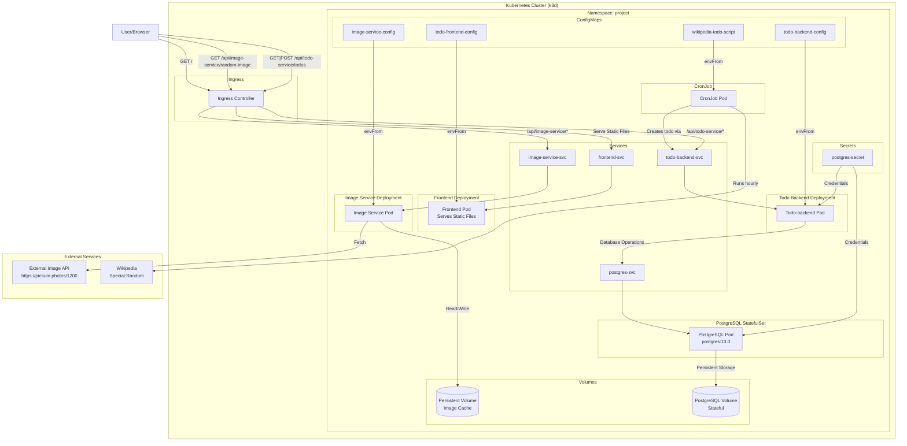
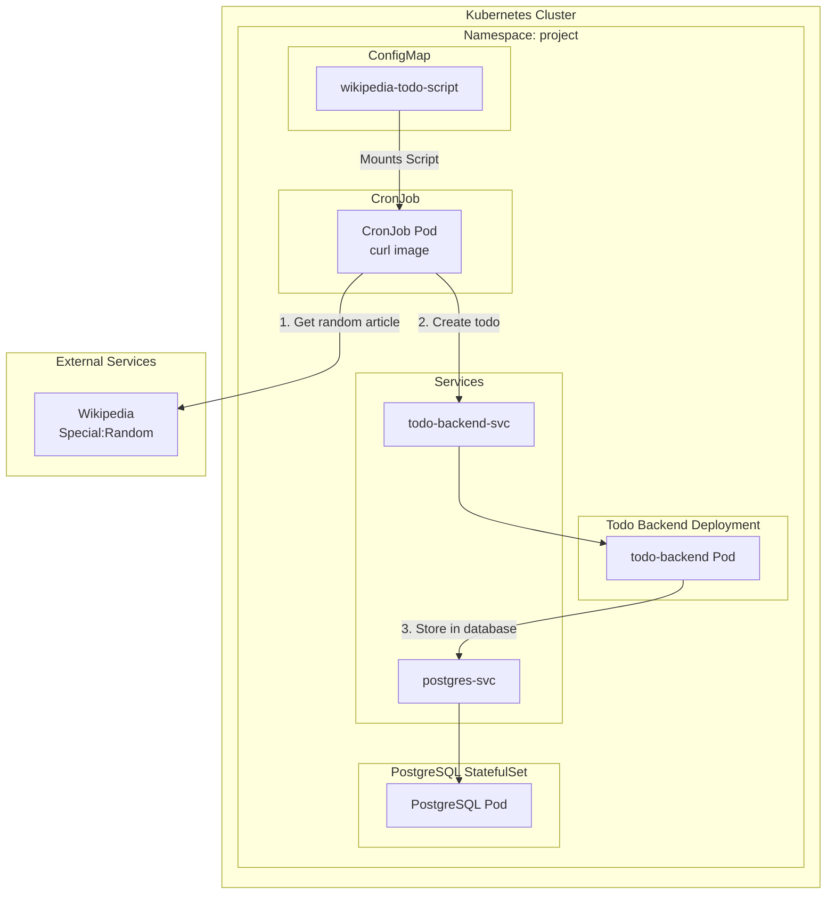

# Application Architecture (Local - k3d)

## Overview

Full-stack application deployed in a **local k3d cluster** under the `project` namespace. It includes:

- **Frontend**: React SPA served via Nginx.
- **Todo Backend**: Node.js API with PostgreSQL persistence and request validation (140-char limit).
- **Image Service**: Caches a random image from `picsum.photos` using a PersistentVolume.
- **PostgreSQL**: StatefulSet with persistent storage.
- **CronJob**: Hourly job that fetches a random Wikipedia article and creates a todo.
- **Ingress**: Routes traffic to frontend, backend, and image service.
- **Monitoring-ready**: Logs are written to stdout for collection by tools like Loki/Grafana.

All external access uses the custom domain `project.local`.

---

## Overall Architecture

### CronJob Detailed Workflow

